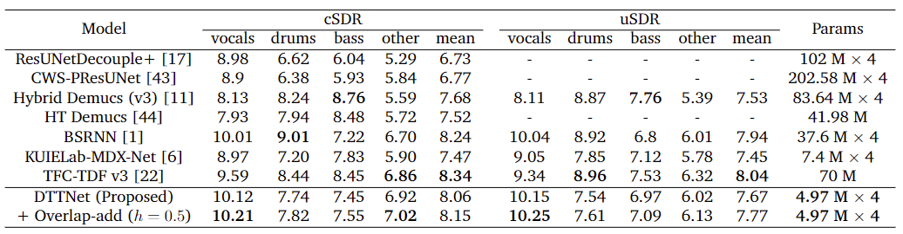

# Dual-Path TFC-TDF UNet

A Pytorch Implementation of the Dual-Path TFC-TDF UNet for Music Source Separation. DTTNet achieves 10.12 dB cSDR on vocals with 86% fewer parameters compared to BSRNN (SOTA). Our paper is coming soon.


## Notes

1. Overlap-add is switched on by default, comment the **values** of key ```overlap_add``` in ```configs\infer``` and ```configs\evaluation``` to switch it off and the inference time will be 4x faster.




## Environment Setup (First Time)

1. Download MUSDB18HQ from https://sigsep.github.io/datasets/musdb.html
2. (Optional) Edit the validation_set in configs/datamodule/musdb_dev14.yaml
3. Create Miniconda/Anaconda environment

```
conda env create -f conda_env_gpu.yaml -n DTT
source /root/miniconda3/etc/profile.d/conda.sh
conda activate DTT
pip install -r requirements.txt
export PYTHONPATH=$PYTHONPATH:$(pwd) # for Windows, replace the 'export' with 'set'
```

4. Edit .env file according to the instructions. It is recommended to use wandb to manage the logs.

```
cp .env.example .env
vim .env
```


## Environment Setup (After First Time)

Once all these settings are configured, the next time you simply need to execute these code snippets to set up the environment

```
source /root/miniconda3/etc/profile.d/conda.sh
conda activate DTT
```


## Inference

1. Download checkpoints from either:
   - https://mega.nz/folder/E4c1QD7Z#OkgM_dEK1tC5MzpqEBuxvQ
   - https://pan.baidu.com/s/1Tw6Fp6wYVZTqjRE-aDZdyw  (code: lgwe)
2. Run code

```
python run_infer.py model=vocals ckpt_path=xxxxx mixture_path=xxxx
```

The files will be saved under the folder ```PROJECT_ROOT\infer\songname_suffix\```


Parameter Options:

- model=vocals, model=bass, model=drums, model=other


## Evaluation

Change ```pool_workers``` in ```configs\evaluation```. You can set the number as the number of cores in your CPU.

```
export ckpt_path=xxx # for Windows, replace the 'export' with 'set'

python run_eval.py model=vocals logger.wandb.name=xxxx

# or if you don't want to use logger
python run_eval.py model=vocals logger=[]
```

The result will be saved as eval.csv under the folder  ```LOG_DIR\basename(ckpt_path)_suffix```


Parameter Options:

- model=vocals, model=bass, model=drums, model=other


## Train

Note that you will need:

- 1 TB disk space for data augmentation. 
  - Otherwise, edit ```configs/datamodule/musdb18_hq.yaml``` so that:
    - ```aug_params=[]```. This will train the model without data augmentation.
- 2 A40 (48GB). Or equivalently, 4 RTX 3090 (24 GB). 
  - Otherwise, edit  ```configs/experiment/vocals_dis.yaml``` so that：
    -  ```datamodule.batch_size``` is smaller
    -  ```trainer.devices:1``` 
    - ```model.bn_norm: BN```
    - delete```trainer.sync_batchnorm```

### 1. Data Partition 
```
python demos/split_dataset.py # data partition
```

### 2. Data Augmentation (Optional)

```
# install aug tools
sudo apt-get update
sudo apt-get install soundstretch

mkdir /root/autodl-tmp/tmp

# perform augumentation
python src/utils/data_augmentation.py --data_dir /root/autodl-tmp/musdb18hq/
```

### 3. Run code

```
python train.py experiment=vocals_dis datamodule=musdb_dev14 trainer=default

# or if you don't want to use logger

python train.py experiment=vocals_dis datamodule=musdb_dev14 trainer=default logger=[]
```

The 5 best models will be saved under ```LOG_DIR\dtt_vocals_suffix\checkpoints```

### 4. Pick the best model

```
# edit api_key and path
python src/utils/pick_best.py
```


## Bespoke Fine-tune

```
git checkout bespoke
```


## Referenced Repositories

1. TFC-TDF UNet
   1. https://github.com/kuielab/sdx23
   2. https://github.com/kuielab/mdx-net
   3. https://github.com/ws-choi/sdx23
   4. https://github.com/ws-choi/ISMIR2020_U_Nets_SVS
2. BandSplitRNN
   1. https://github.com/amanteur/BandSplitRNN-Pytorch
3. fast-reid (Sync BN)
   1. https://github.com/JDAI-CV/fast-reid
4. Zero_Shot_Audio_Source_Separation (overlap-add)
   1. https://github.com/RetroCirce/Zero_Shot_Audio_Source_Separation


